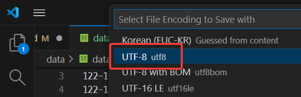
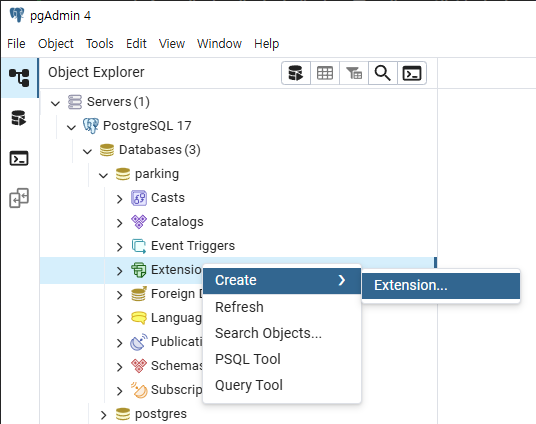
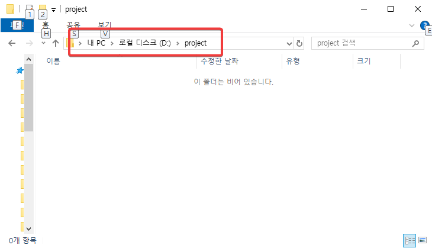

# parking 2025
서울시 강남구 공영주차장 정보

자료: [https://www.data.go.kr/data/15115393/fileData.do](https://www.data.go.kr/data/15115393/fileData.do)

<br>

## 1. 자료 구하기

[정부 데이터센터 화재](http://www.itdaily.kr/news/articleView.html?idxno=235524)로 인한 접속불가로 자료 다운로드: [여기](./data/data_20250905.csv)를 눌러 자료를 다운로드 받으세요.

<br>

## 2. 자료 전처리


### 결손치, 이상치 처리
다운로드받은 파일을 엑셀에서 열어 보자.

결손치 혹은 이상치라고 보기 어렵지만, 여기서는 실습을 위해 "월정기권요금" 항목이 비어 있는 3개의 자료를 삭제하고 **data.csv**로 저장한다.

<br>

### 컬럼명을 영어로 바꾸기
컬럼명이 한글로 되어 있으면 DBMS에서 사용하기 어렵고, 외국인이 사용할 때는 물론이고 한국인이 사용할 때도 문제가 생길 수 있기 때문에 컬럼명은 영어로 바꾸자. 데이터가 한글인 것은 괜찮다.

- 주차장 관리번호: ID
- 주차장명: park_name
- 주차장구분: park_class
- 주차장유형: park_type
- 소재지도로명주소: address_1
- 소재지지번주소: address_2
- 주차구획수: car_count
- 급지구분: land_type
- 부제시행구분: buje
- 운영요일: oper_yoil
- 평일운영시작시각: start_time_1
- 평일운영종료시각: end_time_1
- 토요일운영시작시각: start_time_2
- 토요일운영종료시각: end_time_2
- 공휴일운영시작시각: start_time_3
- 공휴일운영종료시각: end_time_3
- 요금정보: fare_yn
- 주차기본시간: park_free_time
- 주차기본요금: park_default_fare
- 추가단위시간: park_fare_step
- 추가단위요금: park_1step_fare
- 관리기관명: manager
- 전화번호: tel
- 데이터기준일자: date_update

몇몇 안 바꾼 컬럼도 있는데 실제 서비스할 때는 모든 컬럼을 다 한글로 바꾸거나 안 쓰는 컬럼은 지워버리자.


<br>

### 한글 코드 문제


**한글 코드 문제**는 반드시 겪게 되는 문제이다.

[Visual Studio Code](https://code.visualstudio.com/)로 봤을 때 위와 같이 문자가 깨지는 현상을 겪는데, 이건 한글 코드 문제이다. 

엑셀은 **한글 전용 코드**(**EUC-KR**)를 기본으로 사용하는데, 이 EUC-KR은 대부분의 외산 프로그램에서는 제대로 인식되지 않는다. 

최근 대부분의 외산 프로그램들은 파일을 읽 때 이 파일이 UTF-8로 인코딩되어 있다고 가정하고 읽어들인다. EUC-KR로 저장된 걸 UTF-8이라고 생각하고 처리하다보니 위와 같이 깨진 글자로 나타나는 것이다. 

마치 프랑스어로 되어 있는 문서를 영어라 생각하고 처리하면 제대로 처리하지 못하는 것과 비슷하다.

우리는 이 한글 코드를 문제를 다음과 같이 해결한다.

<br>

#### 한글코드를 EUC-KR에서 UTF-8로 변경하기

주의: 한글 코드를 변경하면 엑셀에서 편집할 수 없게 되어 한셀을 이용하게 되는데, 한셀에서도 문서 작업 후 저장하면 다시 EUC-KR로 저장되는 등 불편함이 많다. 그러니 한글 코드 변경작업을 하기 전에 필요한 다른 전처리를 미리 다 해 놓자.

먼저 원래 코드인 EUC-KR로 읽어와서 화면에 제대로 보여지게 한 다음, UTF-8로 변경해서 저장한다.

UTF-8은 대부분의 외국산 프로그램에서도 제대로 인식되는 일종의 국제 공용 코드이다.


1. VS Code에서 data.csv 파일을 열고, 아래쪽의 **UTF-8** 이라고 적힌 버튼을 클릭한다.   


<br>

2. **"Reopen with Encoding"** 을 선택한다.   


<br>

3. **"Korean(EUC-KR)"** 을 선택한다. 이 파일이 EUC-KR로 **인코딩** 되어 있으니 먼저 제대로 된 코드로 읽어와야 한다.


<br>

4. 이제 한글이 깨지지 않고 잘 나타난다. 이 파일이 EU-KR로 인코딩되어 있었는데, EUC-KR로 읽어들이는 처리를 하게 만들었기 때문이다.    


5. VS Code에서 csv 파일을 열고, 아래쪽의 **EUC-KR** 로 바뀐 버튼을 클릭한다.   


<br>

6. "Save with Encoding"을 선택한다.


7. **"UTF-8"** 을 선택한다. 


<br>

바로 UTF-8 코드를 이용해 저장된다.

이제 이 data.csv 파일은 전 세계 대부분의 프로그램에서 읽을 수 있는 UTF-8 코드로 인코딩된 파일이 되었다.

만약 UTF-8로 인코딩된 파일을 엑셀에서 수정하고 싶으면 엑셀에서 읽지 말고 한컴오피스의 한셀에서 읽으면 문제없이 편하게 수정할 수 있다.
<br>

## 3. postgreSQL에 자료 올리기

csv 파일을 postgreSQL에 바로 올릴 수도 있지만 postGIS에 대한 지식도 필요하고 조금 더 복잡하기 때문에 우리는 QGIS에 csv 파일을 올려서 확인한 후 QGIS에서 postgreSQL로 자료를 보내는 방법을 사용하겠다.

### QGIS에서 읽기

1. 새 프로젝트를 생성한다.   


2. CSV 파일 추가 메뉴 선택   


3.  파일을 선택한다.


4. 한글 인코딩 문제를 확인한다.


5. 한글 인코딩, 좌표 설정 등 설정


6. csv 파일의 내용이 QGIS의 레이어로 추가된 것 확인


7. 배경지도를 올리기 위해 "XYZ Tiles > OpenStreetMap" 더블클릭


8. 배경지도를 CSV로 추가한 data 레이어 밑에 놓기 위해 `OpenStreetMap` 레이어 끌어 내린다


9. 배경지도가 맨 밑으로 내려가니 data 레이어가 지도 위에 보여지는 것 확인


<br>

###  postgreSQL에 데이터베이스 생성

1. pgAdmin4에서 데이터베이스를 새로 생성하기 위한 메뉴 선택


2. 데이터베이스 생성


3. 생성된 데이터베이스 확인
   

4. 데이터베이스에 `postgis` extension 설치

   
postgis extension을 설치하지 않으면 레이어를 postgreSQL로 보내기 할 수 없다.

5. `postgis` extension 설치 확인


이제 우리는 이 "parking" 데이터베이스를 사용할 거다.

현재 parking 데이터베이스에는 아무런 자료가 없다.

<br>

### QGIS에서 postgreSQL과 연결

1. 레이어 > 데이터소스 관리자 메뉴를 연다.


2. postgreSQL과 연결하기 위한 `연결정보`를 입력한다.   
   
- 이름: parking
- 호스트: localhost
- 포트: 5432
- 데이터베이스: parking       &nbsp;&nbsp;&nbsp;&nbsp;&nbsp;&nbsp;&nbsp;&nbsp;&nbsp;&nbsp;&nbsp;&nbsp;<- 방금 전 새로 만든 데이터베이스

3. DB와 연결이 잘 되는지 테스트


4. 연결이 잘 되었다는 메시지 확인


5. postgreSQL과의 연결 확인 후 닫기


<br>

###  postgreSQL로 자료 보내기

1. DB 관리자 열기


2. PostGIS > parking을 더블클릭해서 parking 연결 열기


3. QGIS의 `data` 레이어를 postgreSQL로 내보내기
   
    - [3] 입력: QGIS의 레이어 이름
    - [4] 산출 테이블: 데이터베이스에 생성될 테이블 이름

4. 성공메시지   


5. pgAdmin4에서 테이블 생성 확인


<br>


## 4. 프로젝트 폴더 만들고 서버 띄우기

### 프로젝트 폴더 생성하고 서버 실행

1. d:\project 폴더를 생성한다.

2. visual studio code를 실행한다. -> vscode라 부름

3. vscode에서 d:\project 폴더를 연다. 
 

4. 폴더 만든 사람을 믿을 수 있겠냐고 묻는데 그 만든 사람이 나니까 trust 버튼을 누른다.


5. 서버를 실행한다.


6. 웹브라우저에서 확인
   
http://localhost:8080 으로 접속한다.

<br>

## 5. geoserver 작업


geoserver에서는 postgreSQL등에 저장된 공간 데이터를 이용해 WMS, WFS 등의 방법으로 지도 서비스를 제공한다. 

여기서는 geoserver를 이용해 WMS의 방법으로 지도 이미지를 만든다.

<br>

### 가. geoserver 작업공간 만들기

1. 웹브라우저에서 geoserver 접속([http://localhost:8080/geoserver](http://localhost:8080/geoserver/web/?0))

2. geoserver 로그인(기본값: admin / geoserver)   
   


3. geoserver의 **작업공간** 추가 메뉴


4. geoserver의 **작업공간** 추가 실행
   
\* 작업공간의 이름 "parking"   
\* 작업공간의 URI "parking". URI는 다른 작업공간의 URI와 겹치지 않도록 한다.

5. 작업공간이 잘 만들어졌나 확인


<br>

### 나. postgreSQL의 자료를 데이터 저장소로 이용하기

1. 저장소 생성 메뉴


2. postGIS 저장소 선택: postgreSQL 사용


3. postGIS 저장소 추가 실행

    - [1] 작업공간: parking
    - [2] 데이터 저장소 이름: parking_db
    - [3] host: localhost
    - [4] port: 5432
    - [5] database: parking
    - [6] user: postgres
    - [7] password: 미리 설정한 비밀번호
    - [8] Expose primary keys: 체크

<br>

### 다. 추가한 DBMS의 테이블을 이용해 레이어 추가


저장소를 추가하면 자동으로 "새로운 레이어" 화면으로 이동한다. 이 화면을 통해 레이어를 추가할 수 있다. geoserver의 레이어는 지도에서 하나의 주제를 표시하기 위해 사용하는 하나의 레이어와 동일하다.

이 화면에서는 방금 전 연결한 DB가 가지고 있는 모든 테이블 목록을 보여준다. 우리가 연결한 DB에는 `data` 테이블만 있어서 data 테이블만 나타난다.

1. 원하는 테이블 옆의 **발행하기** 버튼 클릭
   


2. 레이어 제목 설정


3. 레이어 최소경계 영역 및 위/경도 영역 설정
레이어 제목 외 다른 설정값들은 그대로 두고, 이 부분들만 설정한다.   


4. 레이어 추가 확인


<br>

### 라. 추가한 레이어를 지도에서 확인

1. **레이어 미리보기** 기능 이용


2. openlayers 형식으로 레이어 미리 보기


<br>

길게 작업한 거 같지만 숙달자는 여기까지 10-20분 정도면 완성되는 간단한 작업이다. 

여기까지 한 작업을 정리하면, 

    - 데이터를 csv 파일 형태로 받아서 
    - QGIS에 올린 다음 
    - postgreSQL에 저장하고, 
    - postgreSQL에 의 자료를 geoserver에서 하나의 레이어로 만들기

이제 이 레이어를 openlayers에서 받아서 배경지도 위에 올려 지도 앱을 완성해 보겠다.

<br>

## 6. openlayers 

<br>

### 가. openlayers 프로젝트 생성

1. 탐색기에서 d:\project 폴더로 이동   


2. src 폴더 생성  


3. powershell 실행   
   
src 폴더에서 powershell 실행

4. powershell에서 openlayers 프로젝트 생성  
  
    ```ps
    PS D:\project\src> npm create ol-app
    ```   
    

<br>

### 나. openlayers 프로젝트 실행 테스트

1. 프로젝트 실행   
   
    ```ps
    PS D:\project\src> npm start
    ```

2. 브라우저에서 실행([http://localhost:5173](http://localhost:5173))


openlayers 프로젝트 생성하면 기본으로 보여지는 지도를 확인했다. 이 브라우저는 계속 켜 놓은 채로 작업한다. 작업 내용이 자동으로 반영되기 때문.

<br>

### 다. github history 사용법 안내

이제부터 우리는 vscode를 이용해 `d:\project\src` 폴더의 `main.js` 파일을 수정해 가며 지도 앱을 개발해 나갈 것이다.

변경되어 가는 내용은 github의 기능을 이용하면 어떤 부분이 추가되고 삭제되었는지 쉽게 알 수 있어, github의 기능 설명을 안내한다.


[https://github.com/profkim2000/parking2025](https://github.com/profkim2000/parking2025) 에 접속하면 위와 같이 "XX Commits" 부분이 있는데 이 부분을 클릭하면 아래와 같이 개발 history를 볼 수 있다.


이 중 아래와 같이 하나의 history를 클릭하면(하나의 버전을 클릭하면), 


다음과 같이 그 결과를 볼 수 있다.


이렇게 배경색으로 어떤 부분이 추가되었는지 삭제되었는지 알 수 있고, 그로 인한 결과도 알 수 있게 된다.


위와 같이 `View File` 메뉴를 선택하면, 


코드 추가, 삭제 등이 최종 반영된 그 당시의(그 버전의) 코드를 볼 수 있다. 


표시한 버튼을 누르면 코드를 복사(ctrl + c) 할 수 있다.

<br>


### 라. openlayers에서 WMS로 자료 가져와 보여주기

여기서는 main.js 파일만 다룬다. 우리 수준에서 다른 파일은 만질 일이 없다.

#### 1. 프로젝트 생성 직후
```js
import './style.css';
import {Map, View} from 'ol';
import TileLayer from 'ol/layer/Tile';
import OSM from 'ol/source/OSM';

const map = new Map({
  target: 'map',
  layers: [
    new TileLayer({
      source: new OSM()
    })
  ],
  view: new View({
    center: [0, 0],
    zoom: 2
  })
});
```

**결과:**


<br>

#### 2. WMS로 데이터를 이미지(png) 형식으로 가져와 보여주기

```js
import './style.css';
import {Map, View} from 'ol';
import TileLayer from 'ol/layer/Tile';
import OSM from 'ol/source/OSM';
import TileWMS from 'ol/source/TileWMS';

// geoserver에서 WMS의 타일 방식으로 받아온다.
const wmsLayer = new TileLayer
(
  {
    visible: true,
    source: new TileWMS
    (
      {
        url: 'http://localhost:8080/geoserver/parking/wms',
        params: 
        {
          'FORMAT': 'image/png',
          tiled: true,
          "STYLES": '',
          "LAYERS": 'parking:data'  // geoserver에서 postgreSQL의 data 테이블과 연결하도록 정의한 레이어.
        }
      }
    )
  }
);

// osm 레이어를 만든다.
const osmLayer = new TileLayer
(
  {
    source: new OSM()
  }
);


// openLayers를 위한 지도를 만든다.
const map = new Map
(
  {
    target: 'map',
    layers: [osmLayer, wmsLayer],
    view: new View
    (
      {
        center: [0, 0],
        zoom: 2
      }
    )
  }
);
```

* geoserver의 url 설정하는 부분   


* geoserver의 레이어 설정하는 부분


<br>

**결과**


#### 3. 데이터에 필터 걸기: 차 300대 이상 주차할 수 있는 주차장만

```js
import './style.css';
import {Map, View} from 'ol';
import TileLayer from 'ol/layer/Tile';
import OSM from 'ol/source/OSM';
import TileWMS from 'ol/source/TileWMS';

// geoserver에서 WMS의 타일 방식으로 받아온다.
const wmsLayer = new TileLayer
(
  {
    visible: true,
    source: new TileWMS
    (
      {
        url: 'http://localhost:8080/geoserver/parking/wms',
        params: 
        {
          'FORMAT': 'image/png',
          tiled: true,
          "STYLES": '',
          "LAYERS": 'parking:data', 
          "CQL_FILTER": "300 <= car_count"  // CQL_FILTER를 통해 필터링할 수 있다. 
        }
      }
    )
  }
);

// osm 레이어를 만든다.
const osmLayer = new TileLayer
(
  {
    source: new OSM()
  }
);


// openLayers를 위한 지도를 만든다.
const map = new Map
(
  {
    target: 'map',
    layers: [osmLayer, wmsLayer],
    view: new View
    (
      {
        center: [0, 0],
        zoom: 2
      }
    )
  }
);
```

**결과**


**다양한 테스트**


<br>


#### 4. 테스트가 불편하네. 지도 위치: 한국을 가운데, 줌도 설정
```js
import './style.css';
import {Map, View} from 'ol';
import TileLayer from 'ol/layer/Tile';
import OSM from 'ol/source/OSM';
import TileWMS from 'ol/source/TileWMS';

// geoserver에서 WMS의 타일 방식으로 받아온다.
const wmsLayer = new TileLayer
(
  {
    visible: true,
    source: new TileWMS
    (
      {
        url: 'http://localhost:8080/geoserver/parking/wms',
        params: 
        {
          'FORMAT': 'image/png',
          tiled: true,
          "STYLES": '',
          "LAYERS": 'parking:data',  // geoserver에서 postgreSQL의 orak 테이블과 연결하도록 정의한 레이어.
          "CQL_FILTER": "300 <= car_count"
        }
      }
    )
  }
);

// osm 레이어를 만든다.
const osmLayer = new TileLayer
(
  {
    source: new OSM()
  }
);


// openLayers를 위한 지도를 만든다.
const map = new Map
(
  {
    target: 'map',
    layers: [osmLayer, wmsLayer],
    view: new View
    (
      {
        center: [14141228.61632484, 4510829.790027254],
        zoom: 10
      }
    )
  }
);
```

맵을 생성하면서 center 값과 zoom 값을 수정해서 우리가 보고 있는 위치가 가운데 오고 줌도 많이 걸도록 수정

```js
center: [14141228.61632484, 4510829.790027254],
zoom: 10
```        

**결과: 시작하면서부터 보이는 위치와 줌**


<br>

### 자바스크립트 프로그래밍의 필요성

CQL_FILTER를 보다 더 다양하게 추가하거나, 예를 들면 100 버튼을 누르면 100대 이상 주차할 수 있는 주차장을 보여주는 기능, 그외 매우 다양한 openlayers 기능을 이용하려면 자바스크립트 사용 능력이 필수적이다.